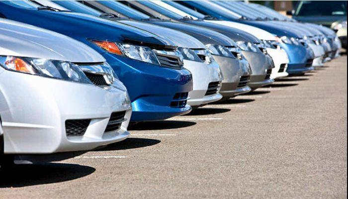
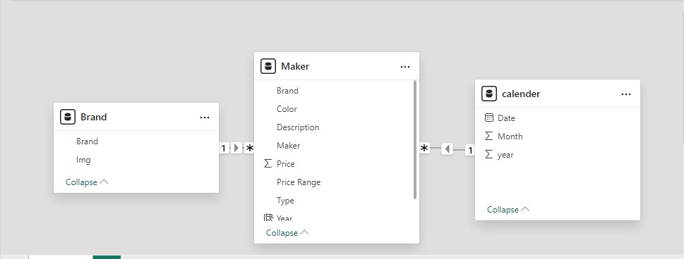
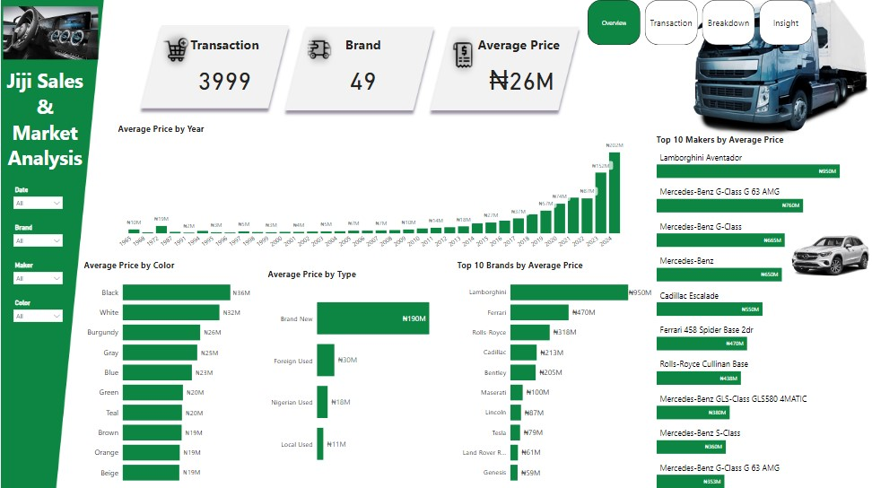
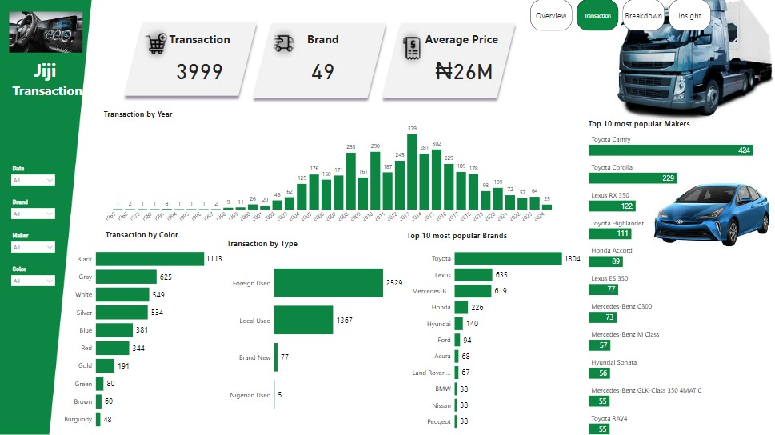
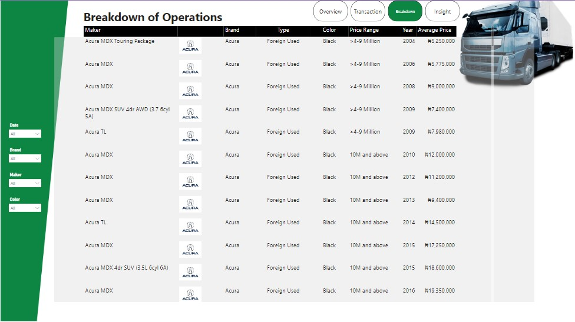
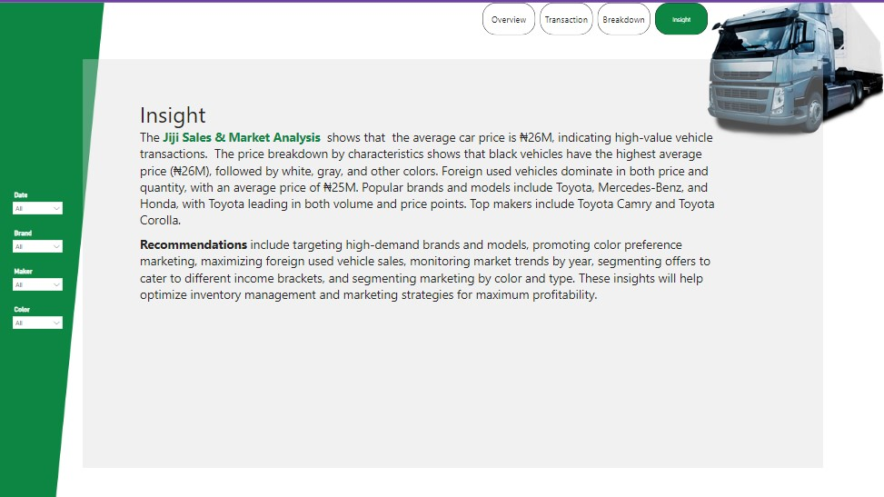

# Jiji-Car-Sales
### Jiji Sales & Market Analysis

#### 1. **Project Overview**
The **Jiji Sales & Market Analysis** is a data-driven project aimed at analyzing car sales data from the Jiji website. The analysis seeks to uncover valuable insights into the pricing trends, brand popularity, and the characteristics of car transactions across various segments. Data was scraped from the Jiji website using **Python**, and **Power BI** was used for in-depth analysis and visualization.

#### 2. **Data Source**
- **Website**: Jiji (https://jiji.ng)
- **Dataset**: Car listings data, including details on vehicle price, year of manufacture, brand, type, color, and transaction details.
- **Scraping Tool**: Python libraries such as `BeautifulSoup` and `requests` were used to extract data from the Jiji website. The data was then cleaned and formatted for analysis in Power BI.

#### 3. **Tools and Technologies Used**
- **Python**: Used for web scraping and data preparation.
- **Power BI**: Employed for data visualization and analysis.
- **Pandas**: For data cleaning and transformation in Python.

#### 4. **Data Cleaning and Preparation**
Once the data was scraped, it underwent the following cleaning steps:
- **Handling Missing Values**: Incomplete or missing data was handled by either imputing missing values or removing irrelevant data points.
- **Data Transformation**: Columns were formatted appropriately (e.g., numeric values, dates, and categorical fields).
- **Creating Calculated Fields**: Derived fields were created, such as calculating the price per brand, type, and year.

  

#### 5. **Data Analysis**
The Power BI dashboard presents key metrics and breakdowns of car transactions, focusing on three main categories: 
- **Transactions**
- **Brands**
- **Average Prices**
  
You can Interact with the Dashboard [Here](https://app.powerbi.com/view?r=eyJrIjoiNDIwZDVmNGItMzk3MS00NWM1LWFmNjUtYTAzZWY3OGFmZjg2IiwidCI6ImRmODY3OWNkLWE4MGUtNDVkOC05OWFjLWM4M2VkN2ZmOTVhMCJ9)

##### 5.1 Overview Dashboard
The first dashboard provides a high-level overview of car sales:
- **Total Transactions**: 3,999
- **Brands Covered**: 49
- **Average Price**: ₦26M

##### 5.2 Detailed Breakdown
The analysis is further segmented into the following areas:
- **Price and Transaction Trends by Year**: The analysis reveals fluctuating car prices over the years, with peaks in particular years driven by various factors like demand and vehicle condition.
- **Average Price by Color**: Black cars had the highest average price at ₦26M, followed by white, gray, and other colors.
- **Average Price by Type**: Foreign-used cars dominate in terms of both price and quantity, with an average price of ₦25M.
- **Average Price by Brand**: Premium brands like Lamborghini and Ferrari command the highest prices, while Toyota, Mercedes-Benz, and Honda lead in volume sales.
- **Average Price by Maker**: The top-selling brands in the market are Toyota, Mercedes-Benz, and Honda, with Toyota vehicles leading in terms of both quantity and average price.

##### 5.3 Transaction Breakdown
The transaction breakdown focuses on:
- **Transaction by Year**: 2017-2019 saw the highest volume of transactions.
- **Transaction by Color**: Black, gray, and white are the most common car colors.
- **Transaction by Type**: Foreign-used vehicles (2,529 transactions) dominate the market, with locally-used cars following closely.
- **Transaction by Brand**: Toyota is the most popular brand, accounting for 1,804 transactions, followed by Mercedes-Benz and Honda.

#### 6. **Insights**
The **Jiji Sales & Market Analysis** shows that the average car price is ₦26M, indicating a preference for high-value vehicle transactions. The price breakdown by characteristics shows:
- **Black vehicles** have the highest average price (₦26M), followed by white, gray, and other colors.
- **Foreign-used vehicles** dominate in both price and quantity, with an average price of ₦25M.
- **Popular brands** include **Toyota**, **Mercedes-Benz**, and **Honda**, with Toyota leading in both volume and price points.
- **Top vehicle models** include **Toyota Camry** and **Toyota Corolla**.

#### 7. **Recommendations**
Based on the analysis, the following recommendations are provided:
1. **Target High-Demand Brands and Models**: Focus on brands such as Toyota, Mercedes-Benz, and Honda, particularly high-volume models like Toyota Camry and Corolla.
2. **Promote Color Preference Marketing**: Vehicles in black, white, and gray tend to attract higher prices, so promoting these colors could yield better sales outcomes.
3. **Maximize Foreign-Used Vehicle Sales**: Foreign-used vehicles dominate the market in both price and volume. Sellers should prioritize foreign-used options to cater to a wide audience.
4. **Monitor Market Trends by Year**: Certain years witness spikes in transactions and prices. Monitoring these trends could provide insights into the best times for marketing campaigns and sales drives.
5. **Segment Offers by Income Brackets**: Segmenting car sales based on price points and targeting different income groups can optimize sales strategies.
6. **Optimize Inventory Management**: Understanding price trends by type and brand will help in better inventory management, ensuring that high-demand vehicles are always available for sale.

#### 8. **Conclusion**
The Jiji Sales & Market Analysis provides a comprehensive overview of the car sales market on the Jiji platform, highlighting important trends, pricing details, and actionable insights. Leveraging these insights will help businesses and individual sellers maximize their profit potential by focusing on key brands, types, and pricing strategies.

#### 9. **Future Improvements**
- Expanding the dataset to include more granular data such as vehicle condition, mileage, and seller ratings to provide deeper insights.
- Incorporating machine learning models to predict future pricing trends and demand.
- Adding more features to the dashboard to provide interactive insights for a wider audience.

#### 10. **Project Files**
The following files are available as part of this project:
- **Python Code**: Web scraping script for extracting data from Jiji.
- **Power BI File**: The interactive dashboard file (.pbix) with all visualizations.
- **Data Source**: Raw data collected from the Jiji website.
